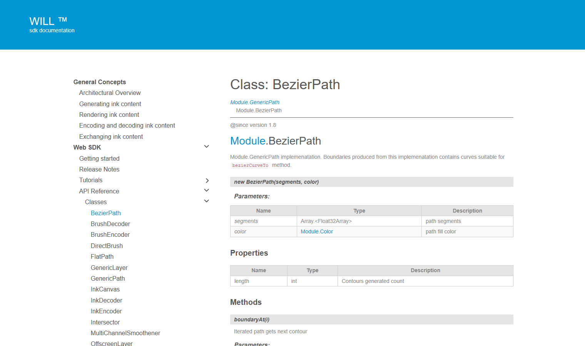

# Getting Started 

## Web Development Environment

Your browser must support the WebGL API. You must also configure the browser to run local content (`file:///`).

You can do this as follows:
* **Google Chrome**: Launch Chrome with the `--allow-fileaccess-from-files` parameter.

* **Mozilla Firefox**: Set the `security.fileuri.strict_origin_policy` parameter to `false`. To do this, enter `about:config` in the address bar, then search for the parameter.

You must enable local content because the engine uses an external file as a memory cache. Enabling local content also allows you to load images for use as particle brush textures.


## Download the SDK

Download the SDK from https://developer.wacom.com/developer-dashboard

* Login using your Wacom ID
* Select **Downloads for ink**
* Download **WILL SDK for Web**
* Accept the End User License Agreement to use the SDK

The downloaded Zip file contains the SDK with documentation.


## SDK License

The SDK is free of charge and does not need a license.

## Using the WILL SDK

### Requirements

Your browser must support the WebGL API. 
You must also configure the browser to run local content (file:///). 
You can do this as follows:

* Google Chrome: Launch Chrome with the ```--allow-fileaccess-from-files``` parameter.
* Mozilla Firefox: Set the ```security.fileuri.strict_origin_policy``` parameter to ```false```. 
  To do this, enter *about:config* in the address bar, then search for the parameter.

You must enable local content because the engine uses an external file as a memory cache. Enabling local content also allows you to load images for use as particle brush textures.

### Folder structure

You can find the engine core in the following folders:

* /web/engine/Module.js
* /web/engine/WacomInkEngine.js
* /web/engine/WacomInkEngine.js.mem


## Tutorials

The tutorials in this section demonstrate how to use WILL SDK for Web. The tutorials are divided into parts, where each part describes the required steps for accomplishing a particular task. 
The following tutorials are provided:

* [Tutorial 1: Drawing with pointing devices](samples/tutorials/Sample1/README.md)
* [Tutorial 2: Encoding and decoding strokes](samples/tutorials/Sample2/README.md)
* [Tutorial 3: Erasing strokes](samples/tutorials/Sample3/README.md)
* [Tutorial 4: Selecting strokes](samples/tutorials/Sample4/README.md)
* [Tutorial 5: Working with rasters](samples/tutorials/Sample5/README.md)
* [Tutorial 6: Collaborating in real time](samples/tutorials/Sample6/README.md)
* [Tutorial 7: Pan and Zoom](samples/tutorials/Sample7/README.md)

The sample code in the tutorials is written in JavaScript. 
Each tutorial has an associated code sample file and many tutorials have sample results that you can view in your browser. 
To view the sample results, you must enable local content in your browser as described in Getting started with WILL SDK for Web.


## API Reference

In the downloaded SDK open this file in a browser:

`documentation\index.html`

The page gives access to the API Reference section:



----

        


